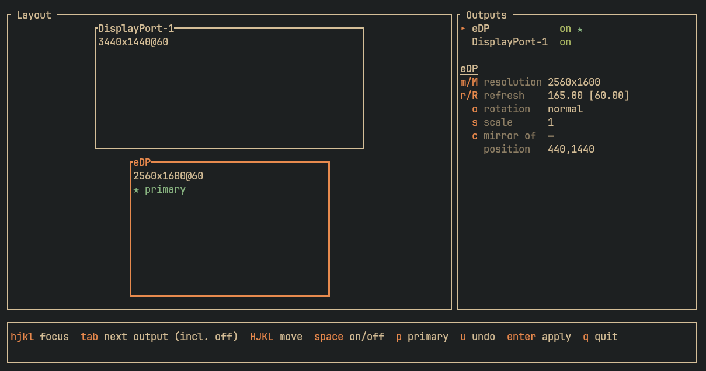

# X11 Monitor Manager (XMM)

A TUI interface for the `xrandr` CLI with vim-like controls.



## Features

- Graphically view arragement of outputs
- Reorder outputs in a layout with egde/center snapping
- Turn outputs on and off
- Change primary output
- Rotate outputs
- Scale outputs
- Mirror another output
- Auto-revert after 15 seconds new layout is not confirmed

## Intended use

> [!WARNING]
> **This is not meant to be an alternative for [autorandr](https://github.com/phillipberndt/autorandr) or similar tools.** It does not contain any auto-layout options, nor does it support persisting a configuration or automatically applying one based on connected displays.

`xmm` is intended to visualize `xrandr` configuration and allow for easy arrangement of outputs without having to calculate pixel values when centering monitors or similar.

## Installing

### Build from source

```sh
# 1. Clone the repo
git clone https://github.com/fzahner/x-monitor-manager
cd x-monitor-manager
# 2. Build to project and copy it to your PATH
cargo build --release
sudo cp target/release/xmm /usr/local/bin/
# 2. OR install it via rust directly (cargo bin folder needs to be added to path)
cargo install --path .
```
